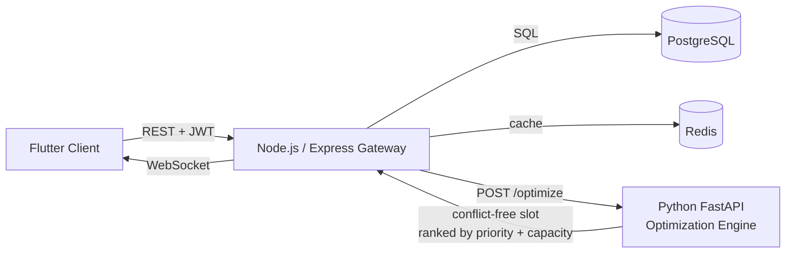

# 💫 About Me

Full Stack Developer with 4+ years building scalable web applications with Java, Spring Boot, React, and Angular. I work on microservices, REST APIs, and secure backend systems with Spring Security, OAuth 2.0, and JWT. Comfortable across PostgreSQL, Docker, Kubernetes, and event-driven systems with Kafka. I also build AI features into real products — RAG pipelines, vector search, and LLM integrations — and I care more about what ships and stays up than about what's trendy.

- 🔭 Currently building RAG and enterprise search workflows in Java and Spring Boot
- 🌱 Sharpening tech skills and distributed systems design
- 💬 Ask me about Spring Boot, Kafka, PostgreSQL tuning, or shipping LLM features that don't hallucinate in production
- 📫 work.karshmattoo@gmail.com

## 🌐 Socials

 

# 💻 Tech Stack

**Languages:**      

**Backend:**       

**Frontend:**     

**Security & Auth:**   

**Databases:**    

**Cloud & DevOps:**       

**Messaging:** 

**AI / ML / Data:**     

**Testing:**    

---

# 💼 Experience

**Full Stack Developer** — McKinsey & Company, USA *(Jan 2026 – Present)*
- Built secure RFP knowledge-retrieval workflows with Amazon Bedrock RAG over OpenSearch, cutting document search time 38%
- Developed 18 REST APIs with Spring Security role-based permissions across ingestion, drafting, audit, and review workflows
- Cut API and page-load latency 34% with Redis caching, PostgreSQL query tuning, and React/TypeScript interfaces
- Expanded automated testing in CI with JUnit, Mockito, Testcontainers, and Playwright, cutting pre-release defects 31%
- Operated containerized services on Kubernetes with Terraform and OpenTelemetry tracing

**Software Developer** — Virtusa, India *(Jan 2021 – Jul 2024)*
- Built payment and transaction microservices handling 50K+ daily transactions with Java, Spring Boot, Oracle, and JMS
- Delivered digital loan workflows processing 5,000+ applications/month with Angular, PostgreSQL, Kafka, and AWS
- Improved backend response times 29% through schema design, indexing, and query tuning
- Built CI/CD pipelines with Jenkins, Maven, Git, Docker, and AWS (EC2, RDS, S3)
- Cut recurring production defects 30% through Splunk and CloudWatch tracing and root-cause analysis

---

# 🧭 How I Work

- **Failure paths first.** Retries, timeouts, and the "nothing available" response get designed before the happy path. Four years on systems taught me that a silent failure is worse than a loud one.
- **The database is the product.** Most latency problems I've fixed were schema and index problems wearing a caching costume.
- **AI with a seatbelt.** I've shipped RAG and LLM features to production. I also write the evals, the guardrails, and the fallback for when the model is confidently wrong.
- **Code review is where I learn.** I'd rather have a bruising review than a quiet merge.

---

# 🚀 Projects

**[Smart Scheduler](https://github.com/karsh33/Smart-Scheduler)** — Distributed Resource Optimization Platform
Flutter client, Node.js/Express gateway, and a Python FastAPI optimization engine over PostgreSQL. The engine detects interval conflicts and assigns rooms by priority and capacity, so double-bookings can't happen. 12 REST endpoints secured with JWT, bcrypt, and Google OAuth, plus WebSocket updates and an analytics dashboard.

**[Employee Attrition Prediction System](https://github.com/karsh33/EmployeeAttritionPrediction)**
End-to-end ML pipeline over 1,470 employee records: preprocessing, SMOTE balancing, feature selection, and four models benchmarked. Tuned XGBoost with RandomizedSearchCV and cross-validation to 0.82 ROC-AUC and 87% accuracy, with SHAP explaining what actually drives attrition.

**Corporate Event Management Portal**
Full-stack event booking app with a C#/.NET and Entity Framework backend, Angular and TypeScript frontend, and SQL Server. Role-based Admin/User access, JWT and Google login, Swagger-tested APIs, and OWASP practices: input validation, CSRF protection, and SQL-injection safeguards.

---

# 🎓 Education

**MS in Computer Science** — State University of New York at Binghamton, USA *(Aug 2024 – May 2026)* — GPA: 3.7/4.0

**BTech in Computer Science** — MIT World Peace University, India *(Jul 2019 – May 2023)* — GPA: 9.0/10.0

---

# 🎮 Beyond Code

Former Tier 1 esports player — competed semi-pro until the schedule and the career stopped fitting together. Still play at a high rank, which is basically a live exercise in reading systems under pressure and making a call in under a second.

---

# 📊 GitHub Stats

 
 
 

### ✍️ Random Dev Quote

---

